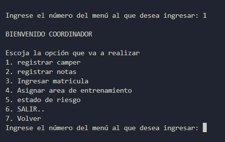

# Proyecto CAmpus (Filtro) 
Este proyecto se desarrolla con la finalidad de afianzar conocimientos de python en general y aplicando los conocimientos para crear un CRUD, aplicando archivos Json
al proyecto le hace falta las funciones del campo del camper para finalizarlo 

|  INDICE  |  TITULO  |
|--|--|
| 1 | MENU PRINCIPAL | 
|1.1| COORDINADOR    |
|1.2| TRAINER        |
|1.3| CAMPER         |

> [!IMPORTANT]  
> Esto es información importante las opciones del menu comparten las funciones de salir y volver al menu anterior

>CARACTERISTICAS DE CADA UNO DE LAS OPCIONES DEL MENU

## FUNCIONES DE COORDINADOR
- Registrar Camper
- Registrar Notas
- Ingresar Matricula
- Asignar area de entrenamiento
- Estado de Riesgo

## FUNCIONES DE TRAINNER
- Asignar Ruta
- Aiganar Horario

> [!WARNING]  
> Las Funciones de camper no se han asigando por falta de requeriminetos

## EVIDENCIA FOTOGRAFICA DE LOS AVANCES
Evidendcia Menu Principal

EVIDENCIA MENU COORDINADOR

EVIDENCIA MENU TRAINNER

ESTOS SON LOS AVANCES DEL PROYECTO JUTNO CON EL JSON EL CUAR GUARDA LOS DATOS DE LOS REGISTROS Y MODIFICA CAMPOS DENTRO DE LOS MISMOS REGISTROS 
COMO SE MUESTRA  A CONTINUACION

